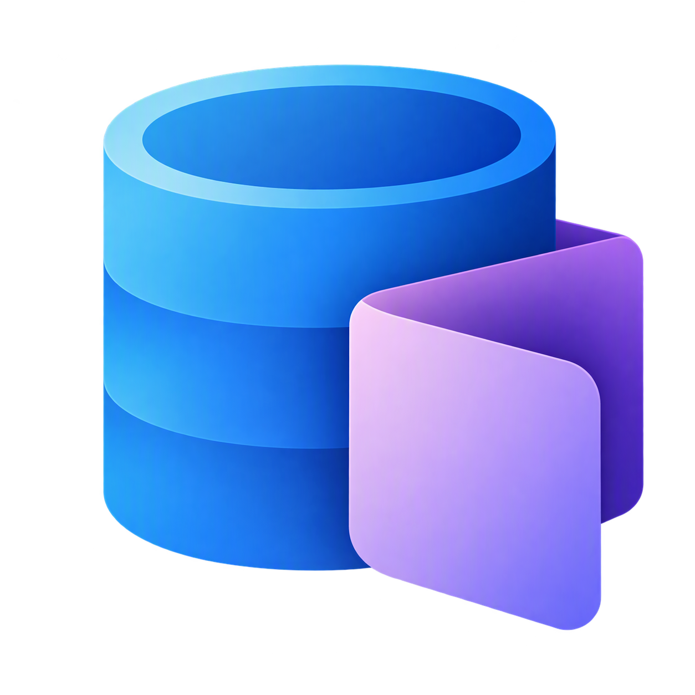

# SQL Apps



**Start free. Build something real. Make it yours.**

SQL Apps gives you a working application foundation and guides for creating your own screens, data and workflows with the AI assistant of your choice. You can start with an idea rather than a framework choice.

## What will you build?

- An equipment checkout app that records loans and returns.
- An inventory app that helps a team find and update stock.
- A registration app that collects and manages signups.
- A small team workflow with records, file uploads or background file processing.

These are ideas for your own application, not prebuilt templates. SQL Apps includes a separate [Todo reference app](examples/todo/README.md) if you want to try a concrete example first.

## Start building

Open this project in your preferred editor and give your AI assistant access to the project files and guides. Ask:

> Help me build an equipment checkout app with SQL Apps. Start by asking who will use it and what it should do. Help me run it locally, then make one useful change. Do not deploy it yet.

Replace equipment checkout with your idea. Follow [Build your app](docs/guides/build-your-app.md) for the walkthrough, or [Get started](docs/guides/getting-started.md) if you need help installing tools.

The journey is **Describe -> Run locally -> Make it yours -> Share optionally**.

Already have Node installed? Check your setup from the project folder:

```powershell
node scripts/setup-check.mjs
```

The check explains missing prerequisites without installing anything. The guides and commands do not require a particular LLM provider. If you use GitHub Copilot, the optional [Copilot plugin](docs/reference/copilot-plugin.md) adds project-specific skills.

## What to expect

**Local first.** No Azure subscription is needed to run locally. You need Node 22 or 24, a .NET SDK, Docker with Linux containers, and access to the Azure SQL Database container. The container is in **private preview**; see its [documentation and signup instructions](https://microsoft.github.io/azure-sql-database-container/) to request access. Initial package and image downloads require internet. Docker and your chosen AI provider have their own licensing/access conditions.

**Your application.** Work with your AI assistant to implement and test its screens and SQL behavior using the existing foundation. This is not a one-command generator. The default foundation has no Todo screen or sample data; examples are selected explicitly.

**A useful first result.** Run the app, create a record, reload it, and make a change such as adding a field or filter. [Run locally](docs/guides/run-locally.md) explains the available startup paths and how to keep your data between sessions.

**Sharing is optional.** Azure is the cloud target. Free tier means recurring allowances, not trial credits or unlimited usage. The current templates also include paid resources, and the minimal public-demo deployment workflow is not yet complete. Read [Sharing your app](docs/guides/sharing.md) and [Costs and growth](docs/guides/costs.md) before choosing a cloud path.

## Find your next step

| I want to... | Start here |
| --- | --- |
| Set up my computer | [Get started](docs/guides/getting-started.md) |
| Turn an idea into an app | [Build your app](docs/guides/build-your-app.md) |
| Try the included example | [Todo reference](examples/todo/README.md) |
| Start, stop or resume locally | [Run locally](docs/guides/run-locally.md) |
| Understand cloud costs | [Costs and growth](docs/guides/costs.md) |
| Share with other people | [Sharing your app](docs/guides/sharing.md) |
| Find detailed commands or contribute | [Documentation index](docs/README.md) |

Under the hood, SQL Apps uses TypeScript, Azure SQL Database, Data API builder, Blob Storage and Azure Functions. You do not need to choose or configure cloud services to begin building locally.

For contributions and help, see [Contributing](CONTRIBUTING.md), [Support](SUPPORT.md) and [Security](SECURITY.md).
